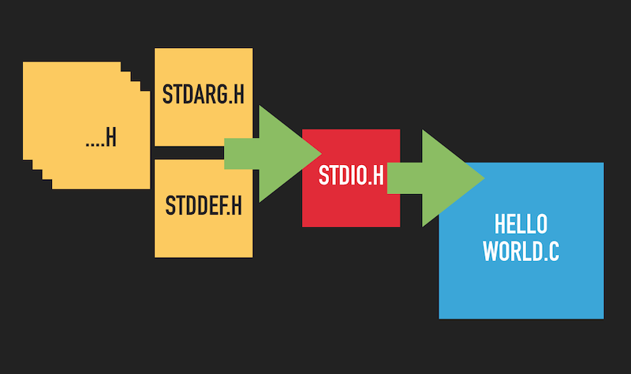

# Hello World

There are actually some things about the classical HelloWorld program that we can learn.

## Structure

    /*
     Author: Marco Trosi
     Date: 2019-09-21
    */

    #include <stdio.h>
     
    int main(void)
    {
       printf("hello\nworld\n"); // print string on terminal
     
       return 0;
    }

One of the first things you should learn about every language is "how to write comments". Because comments are very
important as they provide usually a lot of information that is not obvious just by reading the code. C has 2 types of
comments. Multiline comments and since C99 also the C++\_like single line comments. The classic multiline comments start
with `/*` and end with `*/` and can not be nested. The single line comments start anywhere in the line with `//` and
make the rest of the line a comment.

`#include <stdio.h>` is needed to tell the compiler how the declaration of `printf` looks like. So the compiler can
check if we used `printf` with the correct parameters. A common term is *"to make the function known"*.

Then we need a main function named `main` that acts as the entry point of each program. The `main` function returns an
`integer` and has here no parameters, that's why we use the keyword `void` to show that there are no parameters.

`printf`, the famous function to print text on screen. Here it is called with 1 parameter only which is the string we
want to display. The `\n` means newline as you probably already know. 

And last but not least the return value. Here we return 0.

## Compiling
We will use [GCC](https://gcc.gnu.org) for compiling. Feel free to use another compiler, but the used flags are from GCC, so in order not to be
confused you might wanna use GCC too.

    gcc helloworld.c

This will create an executable file named `a.out`. You can execute it by typing `./a.out` and it should print "hello
world" over 2 lines.

We can also change the executable's filename by using the `-o` flag that is for naming the output file.

    gcc helloworld.c -o helloworld

Now you run it with `./helloworld`.

And another quick way to compile the C file is to use [GNU make](https://www.gnu.org/software/make/manual/make.html) without a `makefile` just by using the *make* default rules,
which results in the same output as the example before.

    make helloworld

## Include
The `#include` command is, like any other command starting with `#`, a command for the `pre-processor`. The
`pre-processor` does pure text replacement. This means that the line `#include <stdio.h>` gets actually replaced with the
content of the given file, in this case the `stdio.h` header file. And this works in a nested way, which means that all
header files included by `stdio.h` are also inserted at the corresponding `#include` lines.

Internally the compiler generates a pre-processed file and that's the one that gets actually compiled.
We can generate and have a look at the pre-processed file with the following command. The `-E` flag tells `gcc` to
pre-process only.

    gcc -E helloworld.c -o helloworld.p

Now open the generated `helloworld.p` and you will see that it is still C code but a much larger file. And if you scroll to
the bottom of your file you will find your `main` function.

## Return

The return value of `main` is the exit code of the program. This can be used to tell the users that the tool was
executed successfully (return value is 0) or that the tool had a problem during execution (return value is different from 0)
Let's test it.

If you want to know the actual exit code of your program after you executed it just type

    echo $?

in your bash shell to display the exit code of the last command executed.
Then change in your code the return value to something else than zero, compile, run, and echo again the exit code.
It should be now the value you provided to the return line. Be aware that tools like *GNU make* and bash mechanisms like
`&&` and `||` use this exact return value to decide how to proceed, so it's an important feature.

***

> **Core Message**
>
> You should try to understand the tools you are using and how they are connected.
> Here we learned what `#include` actually does and what the return value of `main()` is used for.

