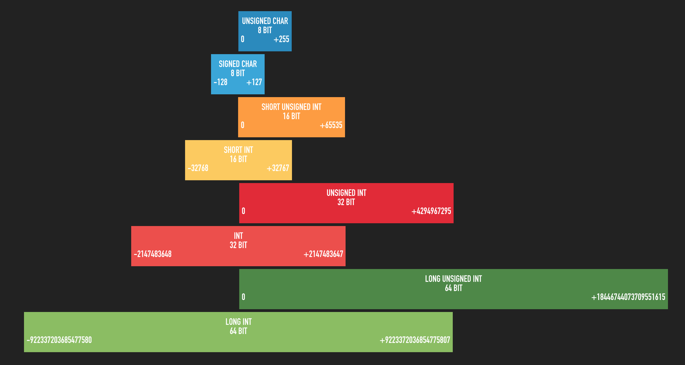
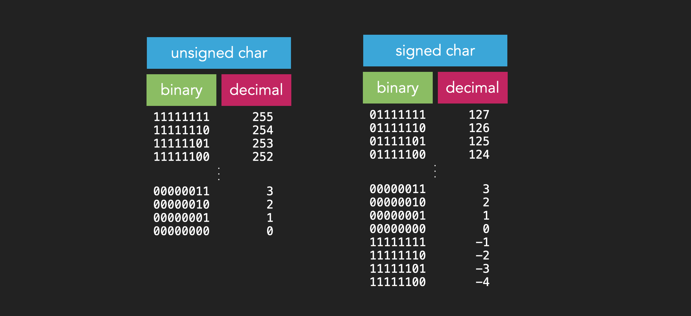
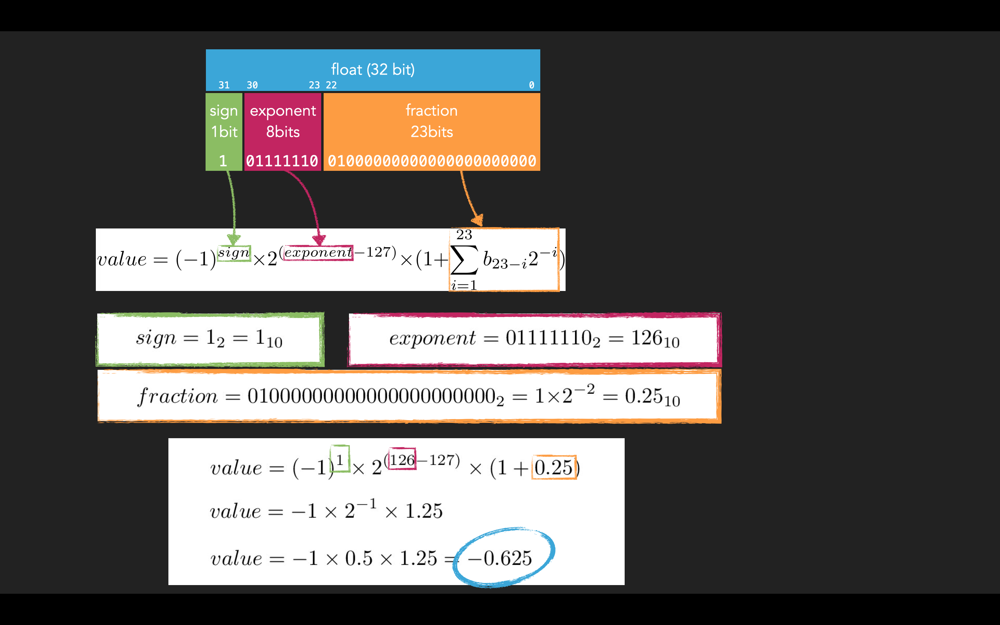

# Data Types - Part 1 - Basic Data Types

This chapter may sound easy and it also is kind of easy, but still many SW errors are due to wrong data types or wrong
interpretation of data. It's actually a very important topic.

## Basic Data Types

C has data types in various sizes for signed integers, unsigned integers and floating point values.
The sizes (bit width) partially depend on the system for which code is compiled. On a 16 bit computer the data types may
have different sizes compared to a 64 bit computer.

Here an example graphic and remember 1Byte == 8Bits

Read and run the [datatypes.c](datatypes.c) file and learn which data types exist, which size they have and which MIN
and MAX values they can hold on your system.

> Nibble, Byte, Word
>> A quick side note just in case you come across these words. We know a Byte is 8 Bits. There is also the so called
>> *Nibble* which is 4 Bits. And there is also the term *Word* which depends on the architecture of your system. If we talk
>> about a 16 Bit micro controller then a *Word* is 16 Bit, which is 2 Bytes. If your system is 32 Bits wide then a *Word* is
>> 4 Bytes, and so on.

### Unsigned Integer

This is probably the most basic datatype that exists. It is used for values greater and equal zero. This datatype exists
in various bit widths. For example on 32 and 64 bit systems they could be defined like in the following table.

bit width   | datatype name          | range
------------|------------------------|--------------------------
 8          | unsigned char          | 0 to 255
16          | unsigned short int     | 0 to 65535
32          | unsigned int           | 0 to 4294967295
32          | unsigned long int      | 0 to 4294967295
64          | unsigned long long int | 0 to 18446744073709551615

Could be? Yes, unfortunately you should not rely on these datatypes. It is probably better to use the datatypes defined in
[`<stdint.h>`](https://en.cppreference.com/w/c/types/integer). The types defined there tell you exactly what you can expect.
At least since C99. Before `<stdint.h>` existed you had to create your own datatypes using `typedef`.

But how are now these values stored exactly? Let's have a closer look at some 8 bit examples.

decimal value | binary representation
--------------|----------------------
 0            | 00000000
 1            | 00000001
 2            | 00000010
 3            | 00000011
 4            | 00000100
 ...          | ....
 252          | 11111100
 253          | 11111101
 254          | 11111110
 255          | 11111111

So with the value 255 the 8 bits are all set to 1. The next value 256 would require at least 9 bits (1 0000 0000) to be
stored, means we have to use a 16 bit variable for that. Now imagine you have an 8 bit variable with that 255 stored,
and you add 1. What will happen? Let's try it. What will this print?

    #include <stdio.h>

    int main(void)
    {
       unsigned char MyVar = 255u;

       MyVar = MyVar + 1u;

       printf("%d\n", MyVar);

       return 0;
    }

It prints 0, not 256. What happened is a so called "overflow". The result that would be mathematically 256, means in
binary `100000000`, gets cut off. Only the most right 8 bits are stored in `MyVar` due to its datatype, which is 8 bit
wide, and so we end up with the 8 zeros, which of course is 0 in decimal.
Always make sure that you are using a big enough datatype for the data you want to store, and ensure that you don't
cause accidentally or unknowingly an overflow.

### Signed Integer

Of course there is also the need to store negative values. For that purpose C has signed integers. This means that 1 bit, the
most left one, is used to indicate whether it's a negative or positive value. So we still have in total 256 values, but
one part is in the positive range and the other in the negative range.

bit width   | datatype name        | range
------------|----------------------|--------------------------
 8          | signed char          | -128 to 127
16          | signed short int     | -32768 to 32767
32          | signed int           | -2147483648 to 2147483647
32          | signed long int      | -2147483648 to 2147483647
64          | signed long long int | -9223372036854775808 to 9223372036854775807

Let's see how these values are stored. First we check the positive range, so the most left bit is 0.

decimal value | binary representation (1 bit signedness + 7 bits for the value)
--------------|----------------------
 0            | 00000000
+1            | 00000001
+2            | 00000010
+3            | 00000011
+4            | 00000100
 ...          | ....
+124          | 01111100
+125          | 01111101
+126          | 01111110
+127          | 01111111

Here the positive range ends, as we have only 7 bits available.

Now let's talk about the negative values. One could assume that the values (the right 7 bits) are the same, but with the
most left signedness bit set to 1. This is not the case. Why is this? The reason is quite simple. Because we still want
to be able to use the CPUs ALU (arithmetic logic unit), which takes care of arithmetic operations, without any special
trickery.

But how is it then? Here a little question. If we add 1 to -1 we get 0. So far so good for the decimal perspective.
We know that 0 is 00000000 in 8 bit binary. So which binary number comes before 00000000, so that when we add 1 we would
get the 00000000? It's 11111111. Looks familiar? That's because it's like the overflow we discussed in the chapter before.

But there is also a quick formula for getting the negative value representation out of the positive value. Simply invert
each bit and add 1. Here an example. Let's say we want -3. So we take 3 which is 00000011 in binary, we invert all bits
which is 11111100, and then we add 1 which is 11111101 which is indeed the binary representation of -3.
And when we repeat the steps, we are back at 3. This is called the [Two's Complement](https://en.wikipedia.org/wiki/Two%27s_complement).

### Float

Now it gets a bit little bit more difficult. C has the `float`, `double` and `long double` floating point datatypes.
Similar as for integer there is a `<float.h>` for that kind of datatypes. The datatype is standardized in the
[IEEE_754](https://en.wikipedia.org/wiki/IEEE_754). I don't want to spend too much time talking about the float
structure, but in the following image you can see it and it shows an example of a 32 bit float. If you like you can try
to understand how the value gets calculated.

## Interpretation

Every value is just a bunch of 1s and 0s that need to be interpreted. How these bit sequences are interpreted depends on
the datatype the variable has that is holding the value.

When we write ...

    int Foo;

... then we know the number of bytes used for this variable `Foo` and we know how the 1s and 0s need to be interpreted.

Let's take the 32 bits from the float example above. We can interpret them as float, signed integer and unsigned integer.

The 32 bits `10111111001000000000000000000000` interpreted as float is -0.625, interpreted as signed int is -1088421888
and interpreted as unsigned int is 3206545408. I added a C file named [float.c](float.c) which you can compile and execute.

### Interpretations by printf

Also the [`printf`](https://en.cppreference.com/w/c/io/fprintf) functions can do some interpretation.
But be aware of what you are doing. It happens quickly that you print something that doesnt make sense.

char   | meaning
-------|---------------------------------------------------------
`%c`   | interpret and write 8 bit value as ASCII character
`%d`   | interpret and write as signed integer
`%u`   | interpret and write as unsigned integer
`%x`   | write unsigned integer as hexdecimal value (lower case)
`%X`   | write unsigned integer as hexdecimal value (upper case)

Compile and run the [interpretation.c](interpretation.c) file.

## Type Conversions
Sometimes it is necessary to convert between datatypes. This can be done implicitly or explicitly.
Here a code snippet that shows the conversions.

    #include <stdio.h>

    int main(void)
    {
       printf("10 / 4 is %d\n", 10/4);          // prints -> 10 / 4 is 2       
       printf("10 / 4 is %f\n", 10/4);          // prints -> 10 / 4 is 0.000000
       printf("10 / 4 is %f\n", 10.0/4);        // prints -> 10 / 4 is 2.500000
       printf("10 / 4 is %f\n", ((float)10)/4); // prints -> 10 / 4 is 2.500000
       printf("10 / 4 is %f\n", (float)(10/4)); // prints -> 10 / 4 is 2.000000

       return 0;
    }

In the 5 example lines above we divide 10 by 4 which is mathematically 2.5.

1. 10 and 4 are both integers so the result is integer too. The result is just the integer part and the 0.5 is "thrown
   away". To be precise it never existed. No conversion happened here.
2. Just like before but we are trying to interpret the integer result as float, which does not help at all. The %f
   doesn't change the result of the division. No conversion happened here. This also gives a compiler warning as we are
   trying to interpret the integer as float.
3. Here the first value (10.0) is now float. To do the division properly the compiler has to convert the 4 implicitly to
   4.0. The result will therefore also be a float value.
4. In this line we use the cast operator. The cast operator is the name of the datatype to which you want to convert
   surrounded by parentheses. So with `(float)10` we convert the integer 10 to a float 10, similar as we would have written
   10.0 like in the line before.
5. In the last line we convert the divion result to float using the cast operator, but it's too late. The result of 10/4
   is integer 2 and converting the 2 to float just gives 2.0.

---

> **Core Message**
>
> Be always aware of what you are doing, of the data type sizes, value interpretation and the
> respective data ranges. Select the right data type for the purpose you need.
