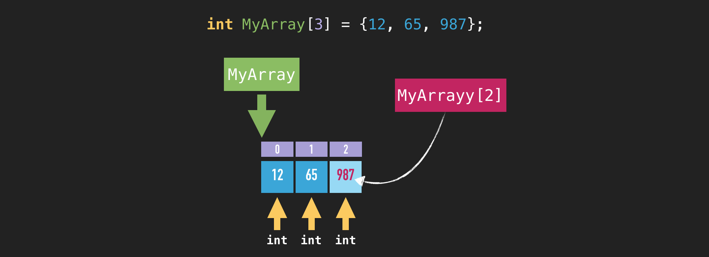

# Arrays

Arrays are lists of variables of any datatype. Instead of creating a single variable you can use arrays to create a
chain of multiple variables. So if you find yourself doing something like that ...

    int Var_1;
    int Var_2;
    int Var_3;

... then it’s probably about time to learn arrays.

    <type> <name>[size];

Example for the "unfortunate" code above ...

    int MyArray[3];

Now you also have 3 integer variables. The difference is that they don’t have names. But you can address them through
the array name and an index. In C arrays start with index 0. Means our array with a length of 3 has the indices 0, 1 and 2.
You can access your array elements with the following syntax ...

    MyArray[0] = 12;
    MyArray[1] = 65;
    MyArray[2] = 987;

Pretty often arrays are iterated using a for-loop. So let's say we want to iterate through all elements 0, 1 and 2 and print them.

    for(int i=0; i < 3 ; i++)
    {
        printf("%d\n", i);
    }

But now we have a problem. We used the value 3 twice in the code. We used it at the array declaration and for the
for-loop break condition. You can bet that one day when you increase your array size you will forget to update your
for-loop. Instead of using magic numbers use a macro or enum if suitable to have only one location that needs to be
updated. 

    #define NUM_OF_ARR_ELEMENTS 3

    int MyArray[NUM_OF_ARR_ELEMENTS];

    for(int i=0; i <  NUM_OF_ARR_ELEMENTS; i++)
    {
        printf("%d\n", i);
    }

Of course `NUM_OF_ARR_ELEMENTS` is bad name and is only for this demo example. You need better names that reflect the
purpose of a symbol. 

You also shall not access elements outside the array bounds. Otherwise it can happen that you read random data or you
overwrite other important data in your memory.

Arrays, just like other variables, can be initialized at the declaration.

    int MyArray[3] = {12, 65, 987};

You can also initialize only a part of that array. The rest will be initialized with zeros automatically.

    int MyArray[3] = {12};

The element 0 is now 12 and the elements 1 and 2 are set to 0.

Initializing everything with 0 is then achieved with ...

    int MyArray[3] = {0};

It is also possible to omit the array size on a declaration with initialization. The size is determined automatically with
the initialization value.

    int MyArray[] = {12, 65, 987};

## Strings - character arrays

C doesn't have strings like other languages. In C strings are character arrays. We will talk about strings more often,
but now we will have a look at strings in the form of arrays of type `char`.

    char MyString[] = {'h', 'e', 'l', 'l', 'o', '\0'};

    printf("%s\n", MyString);

Every array element has been initialized with a character in this example. In C strings are *null-terminated*. The `0`
tells where the string ends. Yes, instead of `'\0'` you can also write just `0`. Without the null-termination `printf`
would continue reading the memory until it stumbles upon a 0.

---

> **Core Message**
>
> Use a constant for the array size.
>
> Ensure not to access memory out of array bounds.
>
> The array size can be omitted and be determined by the compiler with the initializer.
>
> C strings are null-terminated.

