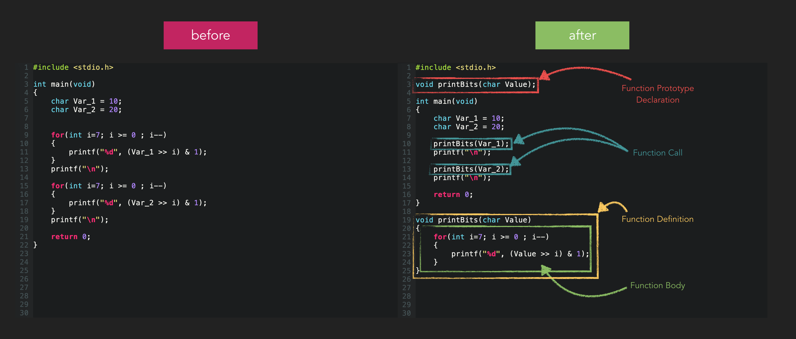

# Functions

Functions are a good way to reduce similar and repetitive code, but also allow reuse of code. Functions also give your
code a structure and increase readability and code comprehension if done right. Functions make your code testable,
exchangeable and make tasks splittable. Many advantages if done correctly.

First let's write some code without using a function and then with a function.

In this code example we just print the single bits of two variables on screen. 

    char Var_1 = 10;
    char Var_2 = 20;

    for(int i=7; i >= 0 ; i--)
    {
        printf("%d", (Var_1 >> i) & 1);
    }
    printf("\n");

    for(int i=7; i >= 0 ; i--)
    {
        printf("%d", (Var_2 >> i) & 1);
    }
    printf("\n");

As you can immediately see it's twice the same code. The only thing that changes is the variable name. And now imagine
you want to do that for many more variables. Instead we should write a function which we can pass any variable of a
certain type to, and the function will do the printing. Before we write it as a function let's check what the syntax of
a function declaration/definition looks like.

Functions can be declared with a function prototype, which tells the compiler how the signature of a function looks
like, means which parameters the function expects, which return value type the function returns and of course the
function name. Therefore the function prototype needs to be written (or included, but we come to that in a later
chapter) before any usage of that function. Generally there is more to learn about functions which we will cover in
upcoming chapters.

    <returntype> <funcname>(<paramtypes>);

You can have zero or more parameters. In case you have no parameters you write `void`. If you have more than one parameter
you just list them separated by commas. The parameter names are optional for prototype declarations but it's common to
provide them. If the function doesn't have a return value then we use also `void`. Here some examples.

    void doMagic(void);

    void setDataRegister(uint32 Data);

    uint32 getDataRegister(void);

    uint32 calcCircleSurface(uint32 Radius);

    uint32 calcCuboidVolume(uint32 Width, uint32 Height, uint32 Depth);

And there is also the function definition that implements the behavior/algorithm of the function. It consists of the
same function signature plus a function body enclosed by curly braces. Make sure that the function definition has the
same parameter names as the declaration, otherwise it's confusing, but you won't get a compile error as long as the
types match. The function body can contain further variable declarations additionally to the function parameters. All
these variables are only known within the function. The only difference is that function parameter variables are
initialized during function call with the values passed to the function. If your function is supposed to return a value
then you need at least one return statement within your function body that returns e.g. the result or a status code.

    <returntype> <funcname>(<paramtype> <paramname>)
    {
        // code
    }

It is possible to combine the function declaration and definition in a single statement. It looks like the definition
followed by semicolon. But we don't do that.

Back to our example. Let's write the function declaration, then the main function with the function calls and finally
the function definition.

    #include <stdio.h>
    
    void printBits(char Value);
    
    int main(void)
    {
    
        char Var_1 = 10;
        char Var_2 = 20;
    
        printBits(Var_1);
        printf("\n");
    
        printBits(Var_2);
        printf("\n");
    
        return 0;
    }
    
    void printBits(char Value)
    {
        for(int i=7; i >= 0 ; i--)
        {
            printf("%d", (Value >> i) & 1);
        }
    }

Great, let's check one more example with a function returning a value.

    #include <stdio.h>
    
    double calcCylinderVolume(double CylinderRadius, double CylinderHeight);
    
    int main(void)
    {
        double Volume = 0.0;
        double Radius = 10.0;
        double Height = 40.0;

        Volume = calcCylinderVolume(Radius, Height);
    
        printf("%lf\n", Volume);
    
        return 0;
    }
    
    double calcCylinderVolume(double CylinderRadius, double CylinderHeight)
    {
        double CylinderVolume = 0.0;

        // CylVol = pi * r * r * h
        CylinderVolume = 3.14159 * CylinderRadius * CylinderRadius * CylinderHeight;

        return CylinderVolume;
    }

When a result of a calculation is used more than ones, then it is probably better to store the result in a variable.
Between the volume calculation and the return statement nothing happens with the variable `CylinderVolume`, so we could
theoretically also drop the result variable `CylinderVolume` and return the result of the calculation directly, which would look like ...

    double calcCylinderVolume(double CylinderRadius, double CylinderHeight)
    {
        return 3.14159 * CylinderRadius * CylinderRadius * CylinderHeight;
    }

The same goes for the function call. Theoretically the `printf()` could look like ...

    printf("%lf\n", calcCylinderVolume(Radius, Height));

... without storing the result first. See, I placed the function call right where the variable was before.
You can imagine that after executing `calcCylinderVolume()` the return value of that function takes its place.

## Naming Functions

Everyone has a personal preference of naming functions and variables, but I think that naming plays an essential role
for the quality of your code. As I mentioned in a previous chapter for variables, the shall reflect the purpose.
That's not different for functions. Select a name that shows what your function is doing.
My recommendation is to start the function name with a *verb*. Functions are always doing something and that something
is most likely an action that can be described with a verb. *set*, *get*, *calculate*, *convert*, *is*, ... just to name
some. The *is*-functions shall return only *boolean* values.
But why a verb? Because it forces you to think about the purpose of your function. And because you are thinking about
it, it is more likely that you automatically keep your functions small and testable, because they have one job only.

## Function-like Macros

Another way to get something similar like a function is using the preprocessor and its function-like macros.
Remember the `#defines` from [chapter 6](../06_constant_values/README.md)? They can also have parameters which makes them look like functions.

    #define <macroname>(<paramaterlist>) <macrocode>

Reproducing our `calcCylinderVolume` as a preprocessor macro could look like this ...

    #define CALC_CYLINDER_VOLUME(r, h) (3.14159 * (r) * (r) * (h))

But be aware that it's all text replacement only. You have to know what you are doing and what the consequences are.
Make sure to put parentheses around each parameter. I show you what can happen if you don't do that. It's similar to the
example in [chapter 6](../06_constant_values/README.md).

    #define CIRCLE_PERIMETER(r) (2 * 3.14159 * r)

The following code would give the wrong result due to operator precedence.

    CirclePerimeter = CIRCLE_PERIMETER(BaseRadius + RadiusExpansion);

Because after text replacement it looks like ...

    CirclePerimeter = (2 * 3.14159 * BaseRadius + RadiusExpansion);

But we need ...

    CirclePerimeter = (2 * 3.14159 * (BaseRadius + RadiusExpansion));

... so we have to put parentheses around each macro parameter.

    #define CIRCLE_PERIMETER(r) (2 * 3.14159 * (r))

That's very important - don't forget the parentheses.
Also don't make the semicolon part of the macro. Create macros without semicolon and put them at the macro call,
otherwise you can not use macros in a nesting way.

---

> **Core Message**
>
> Split function declaration and function definition.
>
> Function names should start with a verb if possible.
>
> *is*-functions shall return a *boolean* type.
>
> Always put parentheses around your macro parameters.

