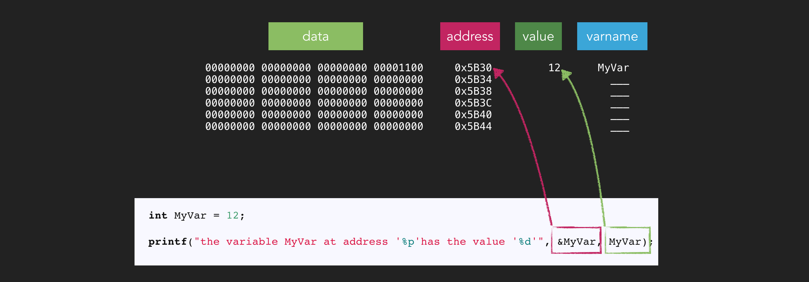
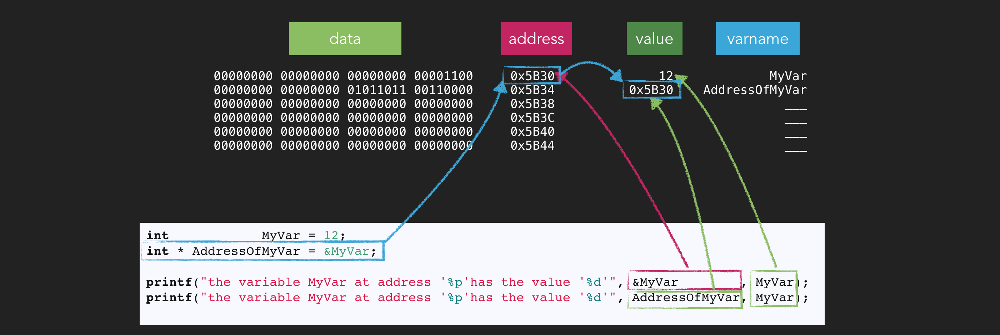
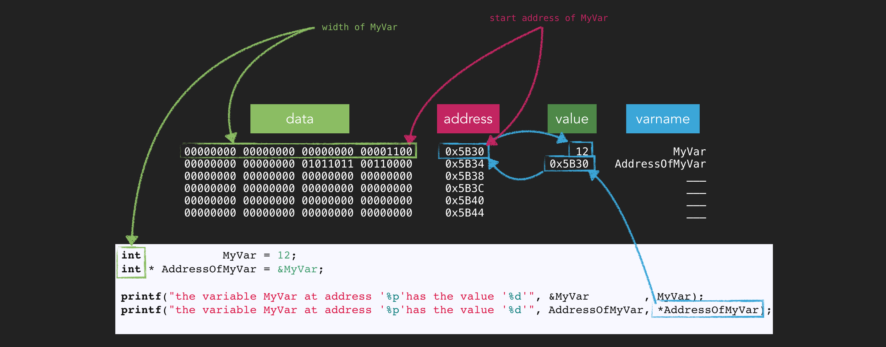
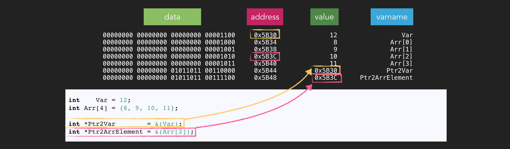
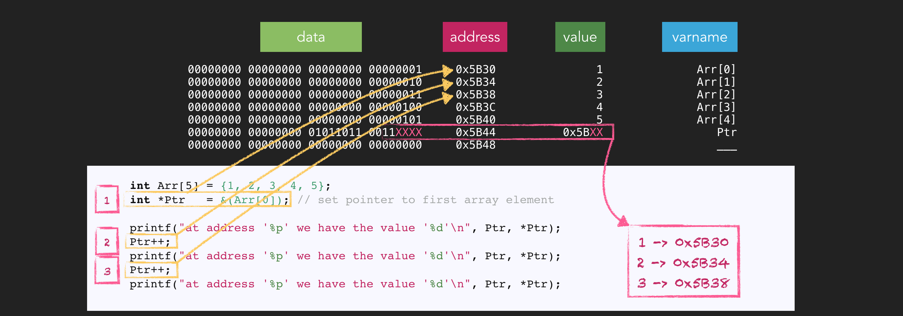
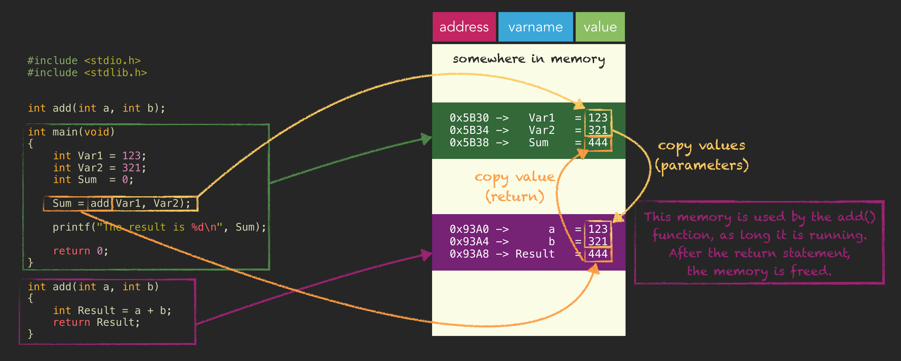
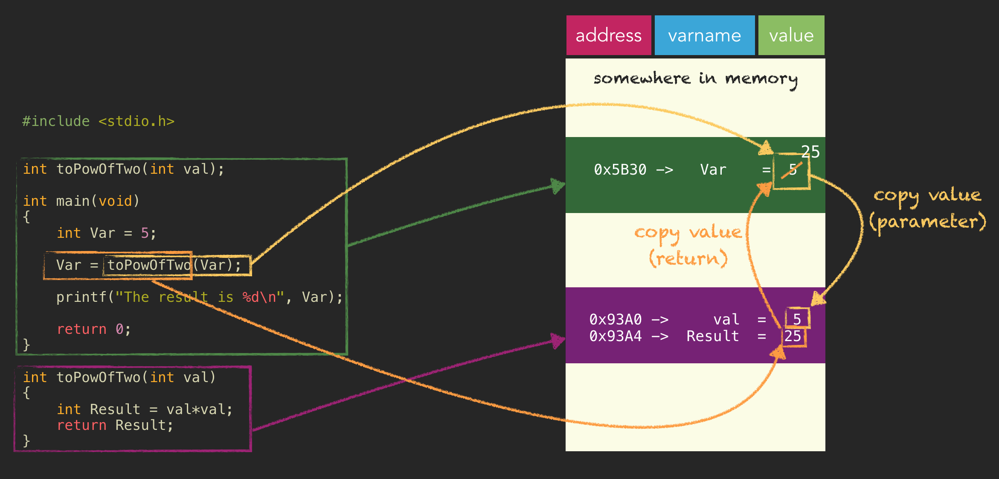
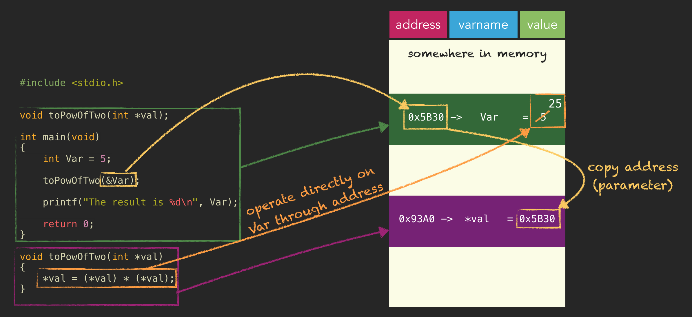
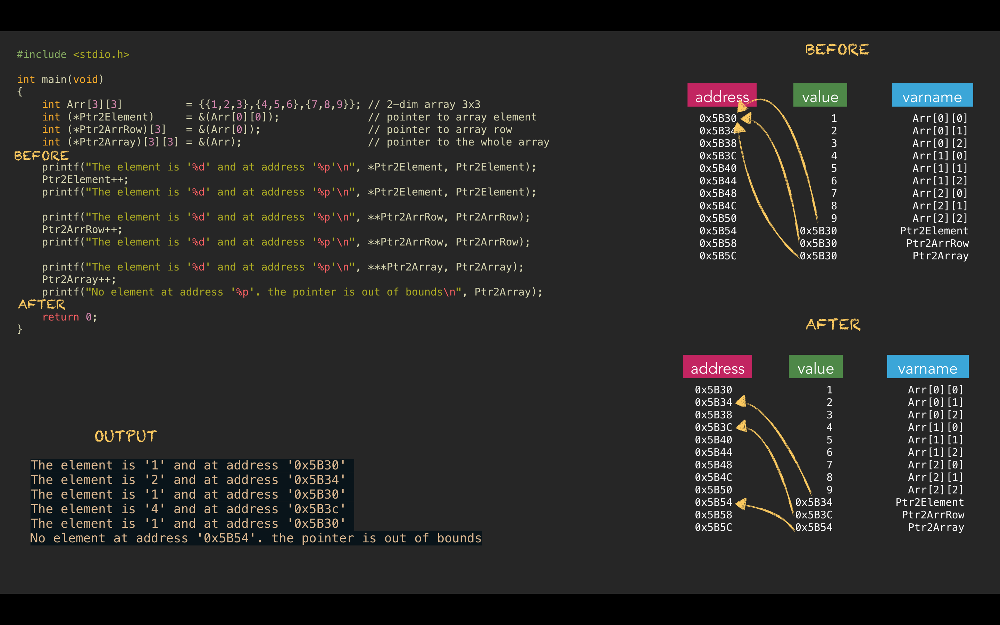

# Pointers

And here we are - it's time to tackle pointers. But don't worry. Some people say pointers are difficult to learn, but
it's less hard if you understand first the concept of memory and addresses. Let's check that out. 

## Memory

In a later chapter we will have a closer look at memory types but for now it's enough to understand memory on an
abstract level. It's just an area where we/the computer/the program have our bits and bytes stored.

These bits are usually stored/addressed in Byte chunks.

Means every Byte has its own address. If you want to read/write these Bytes then we/the computer/the program need(s) to
know where which data is stored - at which address. The following image shows one way of visualizing the memory. You can
see the Byte chunks, each having it's own address. The addresses are usually written in HEX numbers. The data block has
4 columns so that we can see 4 Byte integers at a glance.

For example when we read a variable, we can simply use the variable name. We, the programmers, don't need necessarily
the address of that variable. But the computer knows and uses that internally.
Let's display also the variable names at some random address values and the values.
If you write your own code example you will have totally different addresses. So the addresses used here are arbitrary examples.

     int Foo = 12;
     int Bar = 16;

## Printing Addresses of Variables

If you want to see at which address your variable is stored, you can print the address of a symbol/object.
The `&` operator in front of a symbol gets the address of that symbol. The wording in my head is indeed *"get address of \<symbol\>"*. 

    int MyVar = 12;

    printf("the variable MyVar at address '%p' has the value '%d'\n", &MyVar, MyVar);

## Storing Addresses

Now that we know how to get the address of a variable we also might want to store this address somewhere for later
reuse. So we need a second variable with a new type of declaration to store the address of the `MyVar` variable.

    int   MyVar          = 12;
    int * AddressOfMyVar = &MyVar;

Let's print again to see that the value was stored correctly. 

    printf("the variable MyVar at address '%p' has the value '%d'\n", &MyVar        , MyVar);
    printf("the variable MyVar at address '%p' has the value '%d'\n", AddressOfMyVar, MyVar);

Okay works. But we haven't talked yet about the declaration of the `AddressOfMyVar` variable. What is the asterisk `*` doing there?

This `*` makes the variable a pointer. To be precise `int *` means *pointer to `int`*. In other words, `AddressOfMyVar`
is a variable that can hold addresses of integer variables. That is all a pointer is. Just a variable to store
addresses. So it is important to understand that pointers have a fix bit width on each system that can not be changed.
The `int` in the declaration is **not** for the pointer size, because the pointer size is fix, so this `int` has a
different meaning now because of the `*`. You will learn what it means exactly.

## Accessing the Variable/Memory Through the Pointer

Mmmh, if I have the address of a variable stored in a pointer, is it then possible to access the variable's value using
the pointer? Yes it is possible and it is very common. You just have to put a `*` in front of the pointer name, and this
will be interpreted by the compiler as *"read/write from/at the memory address stored in that pointer"*. This is called *dereferencing*.

    int MyVar = 12;
    int * AddressOfMyVar = &MyVar;

    printf("the variable MyVar at address '%p' has the value '%d'\n", &MyVar        , MyVar);
    printf("the variable MyVar at address '%p' has the value '%d'\n", AddressOfMyVar, *AddressOfMyVar);

So when we go to the address stored in a pointer, and you remember it's the address of a variable, how many bits does
the program have to read starting at that address? 8? 16? 32? Maybe 64? How does the program (or the pointer) know which
size the variable has? And that's what the type `int` is for at the pointer declaration. It tells the pointer to read as
many bytes as the size of `int` when used with a `*` like in `*AddressOfMyVar`.
This means in order to access memory through a pointer you need 2 information - the start address and the bitwidth you
want to access.

Of course you can also write to the address stored in the pointer.

    *AddressOfMyVar = 123; // write to MyVar

## Pointer to Array Elements

You hopefully remember that an array is a list of nameless variables accessible through the name of the array and an
index. Pointers can also store addresses of any array element. At the end they are just variables. 

    int Var = 12;
    int Arr[4] = {8, 9, 10, 11};
    
    int *Ptr2Var        = &(Var);
    int *Ptr2ArrElement = &(Arr[2]);

Index 2 is just an example. It could be any of the 4 elements. But you see, there is no difference to
normal non-array variables.

## Inc- /Decrementing Pointers

You remember what happens when an integer-like type is incremented or decremented using `++` or `—-`. The value is increased or decreased by 1.

    int Var = 5;

    Var++; // 6

What happens if we do that with a pointer? Remember, a pointer contains an address. So what happens to that address
value that is stored in a pointer? Let's just print it before and after to see what changes. 

    int Var  = 5;
    int *Ptr = &Var;       // store address of Var in Ptr
    
    printf("'%p'\n", Ptr); // print address before
     
    Ptr++;                 // increment address value
    
    printf("'%p'\n", Ptr); // print address after

Okay, how much has been added? It depends on your system but probably 4. Because the pointer in this example is a
pointer to `int` and therefore an increment is done by the size of `int` which is simply 4 Bytes. Now the pointer is
pointing right after the memory of `Var`. But how can this be useful?

Let's do the same with an array, and I think you can already tell where this is going.

    int Arr[5] = {1,2,3,4,5};
    int *Ptr   = &(Arr[0]);   // set pointer to first array element
    
    printf("at address '%p' we have the value '%d'\n", Ptr, *Ptr);
    Ptr++;
    printf("at address '%p' we have the value '%d'\n", Ptr, *Ptr);
    Ptr++;
    printf("at address '%p' we have the value '%d'\n", Ptr, *Ptr);

So the pointer could iterate the array in a for-loop. But be careful. Never ever should you point outside memory that is
under your control. In this example you can go at most to the last element, but not any further. You don't know what is
behind that array memory. In the previous example we shouldn't have incremented the pointer at all, because we
immediately leave the memory of `Var` and we don't know what's in the memory area.

## Call by Value *vs.* Call by Reference

But for what all this pointer stuff? Why are we doing this? Why can't we just use the variables directly? There are some
reasons, like dynamic memory allocation, but I want you to know and understand two important mechanisms called
*call by value* and *call by reference*.

*call by value* is what you already know from the previous functions chapter. When you call a function with parameters
the values are copied onto the stack of that function. Let's have a closer look.

So pretend we have an `add()` function, which we call with 2 parameters. The passed values are copied into `a` and `b`
of that function. This means that when you modify `a` or `b` inside `add()`, it has no effect on `Var1` or `Var2`,
because only the values have been copied. The memory used for executing the `add()` function is freed when the function
ends.

Here another example for *call by value*. The following function multiplies the passed values with itself and returns
the result. Of course we wouldn't need a function for that. We could simply write ...

    Var = Var * Var;

... but for the sake of demoing something we solve it with a function like this ...

    #include <stdio.h>
    
    
    int toPowOfTwo(int val);
    
    int main(void)
    {
        int Var = 5;
    
        Var = toPowOfTwo(Var);
    
        printf("The result is %d\n", Var);
    
        return 0;
    }
    
    int toPowOfTwo(int val);
    {
        return val*val;
    }

And now we will write the same functionality, but we will use *call by reference*. This means that instead of passing
the variable to the `toPowOfTwo()` function, we will pass the address of the variable to the function. This means that
we can operate directly on the variable, and not on a copy of the value. Therefore we don't have to return anything. In
order to accept the address as function parameter, we need to have accordingly a pointer declaration as function parameter.

    #include <stdio.h>
    
    
    void toPowOfTwo(int *val);
    
    int main(void)
    {
        int Var = 5;
    
        toPowOfTwo(&Var);
    
        printf("The result is %d\n", Var);
    
        return 0;
    }
    
    void toPowOfTwo(int *val)
    {
        *val =  (*val) * (*val);
    }

So when does it make sense to use *call by reference*? You can use it for example when you need multiple return values,
or when a parameter is way too big in size to be copied onto the function stack.

## Const Pointers

Let's quickly repeat what `const` does to variables.

    int       Var1=0;
    int const Var2=0;

    Var1++; // possible
    Var2++; // not possible

So `const` objects can not be modified.

For pointers it's the same. But be aware that pointers point to a certain type, like an `int`, but it can also be a `const
int`. This means for pointers we can have 2 types of `const`. The first one is the `const` keyword for the pointer itself,
means you have to initialize the pointer with an address at declaration because it can't be changed afterwards. The
second `const` keyword is for the datatype the pointer is pointing to, means that the object the pointer is pointing
to can not be modified because it's constant.

    int       *       Ptr1 = &Var1; // the pointer and the variable can be modified
    int       * const Ptr2 = &Var1; // the pointer can not be modified, the variable can be modified
    int const *       Ptr3 = &Var2; // the pointer can be modified, the variable can not be modified
    int const * const Ptr4 = &Var2; // the pointer and the variable can not be modified

As a mnemonic you can remember that what is written in front of the `const` keyword can't be modified. The asterisk
represents the pointer and the datatype is the object we are referencing.

If the variable is `const` then your pointer should be declared accordingly, otherwise you will get a warning saying
that the pointer discards the `const` qualifier of the variable.

## Pointer to Struct

You know that *struct* variables have members that can be accessed separately. How does this look like when we store the
address of a *struct* in a pointer variable.

    typedef struct
    {
        int A;
        int B;
    } StructType;

    StructType MyStruct = {3, 5};

    StructType *MyPtr = &MyStruct;

    printf("A of MyStruct is %d\n", MyStruct.A); // the direct access
    printf("A of MyStruct is %d\n", (*MyPtr).A); // access by dereferencing the pointer

But there is a syntactical sugar available when accessing *struct* members through a pointer.

    printf("A of MyStruct is %d\n", MyPtr->A); // dereferencig pointer with a nicer notation

## Pointer to Pointer

Yes, pointers can also point to other pointers.

    int   Var    = 0;
    int  *Ptr    = &Var;
    int **PtrPtr = &Ptr;

Means that if you want to dereference down to the variable you need 2 asterisk.

    **PtrPtr = 123; // store 123 in Var

## Function Pointer

You can also reference functions. Such function pointer declarations look just like function prototype declarations but
the function names are replaced with `(* pointername)`. 

Here an arbitrary function declaration

    int MyFunc(int a, int b);

And here a function pointer declaration

    int (*MyFuncPtr)(int a, int b) = MyFunc; // or &MyFunc

And you can also call the function through the function pointer. 

    MyFuncPtr(3,4);

## Void Pointer

Maybe you have already seen some memory library functions like [`malloc()`](https://en.cppreference.com/w/c/memory/malloc).
These functions return a *void pointer* `(void *)`. The *void pointer* is basically just the start address of a piece of
memory, that was created dynamically for you on request, without the bitwidth information, which then of course means
that you can't increment/decrement or dereference a *void pointer* because the program wouldn't know how many bits to
read when dereferenced or how much to add/subtract when incremented/decremented.

So you need to assign the returned *void pointer* to a *non-void pointer* to add bitwidth information.
Or before dereferencing/incrementing/decrementing you have to cast the *void pointer* to a *non-void pointer*.

    #include <stdio.h>
    #include <stdlib.h>
    
    int main(void)
    {
       int  *Mem  = malloc(4); // get 4 bytes, and assign to  INT pointer. It's also possible to add a cast to (int*) right before malloc()
       void *Mem2 = malloc(4); // get 4 bytes, and assign to VOID pointer
    
       *Mem           = 123;
    // *Mem2          = 123; // not possible, missing datatype and therefore missing width information
       (*(int *)Mem2) = 123; // possible with a cast
    
       printf("the memory at address '%p' contains the value '%d'\n", Mem , *Mem ); 
    // printf("the memory at address '%p' contains the value '%d'\n", Mem2, *Mem2);  // not possible, same reason as above
       printf("the memory at address '%p' contains the value '%d'\n", Mem2, (*(int *)Mem2)); 
    
       return 0;
    }

## Null Pointer

`NULL` is basically just a zero casted to void pointer.

    #define NULL ((void*)0)

Just like you use 0 to initialize integers you can use `NULL` to initialize pointers.

    int *MyPtr = NULL;

Also some functions which return addresses, like [`malloc()`](https://en.cppreference.com/w/c/memory/malloc),
use `NULL` as a return value to indicate an error. If no error occurred then you will get a valid address instead.

    #include <stdio.h>
    #include <stdlib.h>
    
    int main(void)
    {
       int *Mem = malloc(4); // try to get 4 bytes

       if(Mem == NULL) // check if memory allocation was successful
       {
          printf("Could not allocate memory\n");
          return 1;
       }
    
    // more code here
    
       return 0;
    }

## Pointer to Array

This section is actually not so much about pointers referencing arrays, but about raising awareness that the pointer
type is important when dereferencing or inc/decrementing the pointer.

    int Arr[4]     = {1,2,3,4};
    int (*Ptr1)[4] = &Arr;

This pointer is now pointing to the array as a whole `(4*sizeof(int))`, which means that when we increment this pointer
that we would leave again the array boundaries, which is a bad idea.

But it can be useful for example when used on 2-dimensional arrays.

    #include <stdio.h>
    
    int main(void)
    {
        int Arr[3][3]          = {{1,2,3},{4,5,6},{7,8,9}};
        int (*Ptr2Element)     = &(Arr[0][0]);
        int (*Ptr2ArrRow)[3]   = &(Arr[0]);
        int (*Ptr2Array)[3][3] = &(Arr);
    
        printf("The element is '%d' and at address '%p'\n", *Ptr2Element, Ptr2Element);
        Ptr2Element++;
        printf("The element is '%d' and at address '%p'\n", *Ptr2Element, Ptr2Element);
    
        printf("The element is '%d' and at address '%p'\n", **Ptr2ArrRow, Ptr2ArrRow);
        Ptr2ArrRow++;
        printf("The element is '%d' and at address '%p'\n", **Ptr2ArrRow, Ptr2ArrRow);
    
        printf("The element is '%d' and at address '%p'\n", ***Ptr2Array, Ptr2Array);
        Ptr2Array++;
        printf("No element at address '%p'. the pointer is out of bounds\n", Ptr2Array);
    
        return 0;
    }

In this example I declared a 2-dimensional array with 3x3 fields. Then I created 3 pointers of different types.
`Ptr2Element` is pointer that references `int`. `Ptr2ArrRow` is a pointer that references 3 integers, so basically one
row in that array. And finally `Ptr2Array` that references a 3 by 3 array. So when incrementing the pointers the amount
of address value added is different for each pointer.

> **Core Message**
>
> The & operator in front of a symbol gets the address of that symbol.
> 
> Pointers are just variables that store addresses.
> 
> Do not access memory out of bounds.
> 
> The pointer type gives information about the bitwidth of the referenced object, which is required for dereferencing,
> incrementing and decrementing. Select the proper type for your pointers.
>
> Pointers have a fix bitwidth which depends on the underlying system.
>
> Pointers can have the `const` keyword a two locations. One is for the referenced object, the second for the pointer
> itself. What is written in front of `const` is constant.
>
> For accessing struct members through a pointer there is an alternative notation available. `Ptr->Member`.
>
> Pointers can also reference other pointers.
>
> A void pointer has no bitwidth information and can therefore not be dereferenced or inc- /decremented.
>
> NULL (null pointer) can be used to initialize pointers but are also used by functions to indicate an error.
