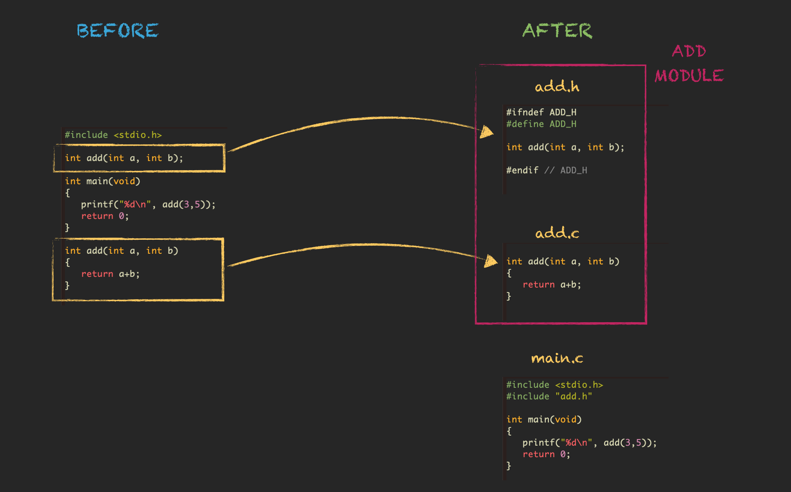
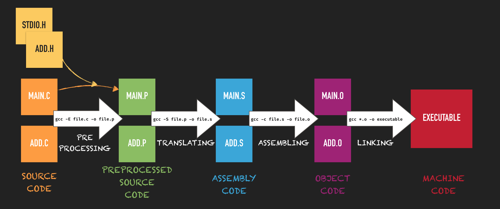
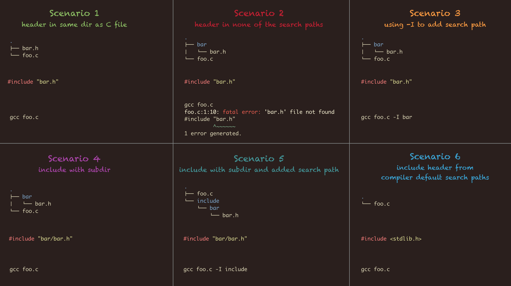
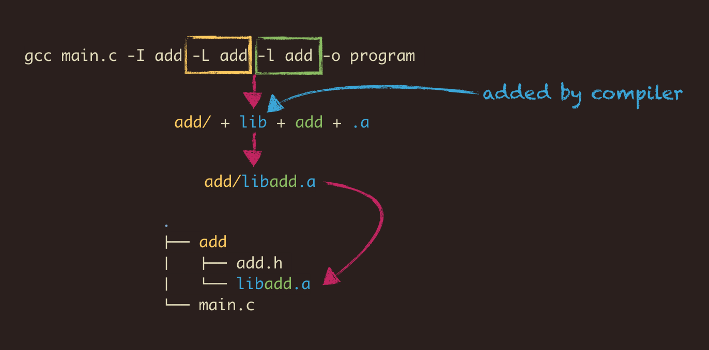

# Modules And Libraries

To give your program a better logical structure, C, like any other language, has the possibility to split the code into
multiple files. This way you don't end up with a single super long C file. But that's not the only advantage. This
allows you also to share your functions with others so that they can use it in their programs. This means that not
everyone has to re-write code again that someone else has already written. Think of `printf()` - a function that someone has
written and you can use it in your code. Also updating C files in your project will be easier. And when you use a build
tool like GNU make then you can incrementally build projects which can safe a lot of time.

## Modules

Let's do a before and after. First we write a single file and have a closer look at it,
and then we extract the function and create a module.

> The term **module** might mean something different for other people. In every company I have been so far the meanings of the terms
> **module**, **component** and **unit** have been discussed. I don't even know if there is an official definition for them.

### All In One File

    #include <stdio.h>

    int add(int a, int b);

    int main(void)
    {
       printf("%d\n", add(3,5));
       return 0;
    }

    int add(int a, int b)
    {
       return a+b;
    }

Okay, we got all in one file and we can compile it for example with ...

    gcc main.c -o program

... if our file is named `main.c` and if we want to name our executable `program`.
So far so good - nothing new here.

### Splitting The File

Now let's create a module consisting of 2 files - `add.c` and `add.h`. 
We put the function definition in `add.c` and the function prototype declarations in `add.h`.
Of course our header file also needs an *include guard*.

By using `#include "add.h"` the content of `add.h` gets inserted back by the pre-processor,
so it's if like we never moved it from `main.c` to `add.h`. 

##### main.c

    #include <stdio.h>
    #include "add.h"
    
    int main(void)
    {
       printf("%d\n", add(3,5));
       return 0;
    }

##### add.h

    #ifndef ADD_H
    #define ADD_H
    
    int add(int a, int b);
    
    #endif // ADD_H

##### add.c

    int add(int a, int b)
    {
       return a+b;
    }

How do we compile this? We have to list all C files, and the compiler will translate each one of them and combine them
to a single executable. The combining-step is called *linking*.

    gcc main.c add.c -o program

### Compiling & Linking

In the example before the compiling and linking has been done with a single *GCC* call.
But we actually can also compile each file separately and link manually at the end.
This is what you typically do when using a build tool.

    gcc -c main.c -o main.o
    gcc -c add.c  -o add.o
    gcc main.o add.o -o program

So what is happening here? The `-c` flag tells *GCC* to only compile the C file. The output of that process is a so
called *object* file, which typically has the file extension `.o` or sometimes `.obj`. We compile both C files and the
result is two object files which we have to link to get our executable. The compiling and linking of the C files was
done by the compiler all the time internally, just like the preprocessing which we made visible in previous chapters by
using the `-E` flag. There is actually one more build step that is happening in the background - the translation. We can
get the intermediate result with the `-S` flag when using *GCC*.

Here is a graphic showing all the compilation steps if executed manually.

Usually for small projects that compile quickly you go from C files to executable directly, as we did in all the
previous chapters. For big projects you might consider compiling the source files to objects and do the linking
separately, all by using a build tool like *GNU make*. The other 2 intermediate steps (preprocessing and translating)
can be interesting if you have to debug your code. For example when you have to know how your macros get expanded, then
you can use `-E` to get a preprocessed source file. If you suspect a compiler bug, or if you are coding for embedded systems
then the `-S` flag allows you to check the assembly instructions.

### Header File Location

In order to process the `#include "header.h"` instructions properly, the preprocessor has to know where the header files
are located. What I didn't tell you so far is that the preprocessor looks at certain default locations for header files
and the very first search location is simply the same directory where the currently processed C file is located. This is
why compiling our examples was never an issue, because all files were in the same directory. So what are the default
header file search directories? There is a little command to make your *GCC* print the paths on screen.

    echo | gcc -Wp,-v -xc - -fsyntax-only

Here an example output of that command.

    #include "..." search starts here:
    #include <...> search starts here:
     /usr/lib/gcc/x86_64-linux-gnu/4.8/include
     /usr/local/include
     /usr/lib/gcc/x86_64-linux-gnu/4.8/include-fixed
     /usr/include/x86_64-linux-gnu
     /usr/include
    End of search list.

If the preprocessor doesn't find the header file at the C file location, it continues with the other default search
directories. The preprocessor simply combines the filename given with `#include "filename.h"` with all the paths in that
list if necessary, and the first one that matches will be included. If no file is found then you will get an error
message.

But you can add more directories to the list by using the `-I path/to/include/dir` *GCC* commandline argument.
We can test it by moving the 2 *add* module files in a dedicated folder. This folder is not in the search list and
therefore the compilation will fail.

    mkdir add
    mv add.c add.h add/
    gcc main.c add/add.c -o program

and there it fails ...

    main.c:2:10: fatal error: 'add.h' file not found
    #include "add.h"
             ^~~~~~~
    1 error generated.

Now let's add the `add` folder to the list of include paths with the `-I` flag.

    gcc main.c add/add.c -I add -o program

Alternatively we could have written also `#include "add/add.h"`. In fact for some modules/libraries we even combine the
*include* flag and directory names in the *include* instruction.

Here a graphic that illustrates all scenarios I just explained. Each scenario shows the directories and files, the
`#include` line and the compiler call.

## Libraries

Libraries are just pre-compiled sources. But this also means that libs have to be compiled for a certain target like MS
Windows or Linux or whatever. So instead of compiling the module sources along with the rest, they get compiled upfront
and can then be shared. Libraries can be interesting if you want to hide your sources or if you want to spare the users
the process of compiling the module. We distinguish static and dynamic libraries. Static libraries have to be linked to
the program and dynamic libraries are loaded at runtime by the program. Therefore dynamic libraries have 2 additional
use cases. One is to be able to exchange/update the library without updating the whole program, and the other use case
is to keep programs smaller and share the common libraries amongst them. Libraries have various file extensions which
you can see in the following table.

|        | static | dynamic
|-------:|:------:|:-------:
|Linux   |  .a    |  .so
|Windows |  .lib  |  .dll

### Creating And Using Static Libraries

Let's create a static library from our little *add module*.
In the first step we compile just regularly the `add.c` to an *object* file named `add.o`.

    gcc -c add.c -o add.o

Please don't get confused - `-c` means *compiler only* and `-o` means *output*, and there is no connection to the file
extensions, that's just a coincidence. I can also change a bit the sequence to `gcc -c -o add.o add.c`.

Many object files can now be combined to an archive (`*.a`), a.k.a. a static library, but in our case it's just a single
object file. And that is actually all it is - just some object files bundled together. For that purpose we can use a
program called `ar`. Our library file we will call `libadd.a` which follows a certain naming convention, and I show you
later why we do that.

    ar -rcs libadd.a add.o

When you look on the internet you will probably find a second tool named `ranlib` that was run right after `ar` to get
proper indexing, but this feature is meanwhile already part of `ar` itself. But just in case you are working with an
older `ar` the commandline call would be simply `ranlib libadd.a`. Maybe there are still use cases where `ranlib` is
required - I don't know, I'm not an expert on this topic.

Okay, now we pretend we share our library with the world. Someone wants to use our lib, downloads it and puts it aside
the main source file.

    .
    ├── add
    │   ├── libadd.a
    │   └── add.h
    └── main.c

This person wants to call our function so it is necessary to make the function known by including the header file as it
contains the function declaration. This means we do have to deliver the header file along with the archive. The rest is
super simple because it is just like we handled object files. So we can either compile all C files separately and link
at the end ...

    gcc -c -o main.o main.c -I add
    gcc main.o add/libadd.a -o program

... or we do it in one step ...

    gcc main.c add/libadd.a -I add -o program

The pros and cons have been discussed before.

Now I will show you another method of linking the library, and this method requires the naming convention I mentioned
earlier. Instead of providing the path to the archive we can use the compiler commandline arguments `-L` and `-l`. `-L`
is similar to `-I`, but instead of providing a header file path it is used to provide a library search path. Our library
is in the `add` directory so we use `-L add`. `-l` is used to provide the name of the library to the compiler, but we
only have to specify the library name without the *lib* prefix. As our lib is named `libadd.a` we have to write `-l add`
and the *lib* is prepended automatically.

    gcc main.c -I add -L add -l add -o program

If you want to have full control over the linking stage then you can for example call the linker `ld` yourself. So far
we called the linker indirectly through `gcc`.

If you want to see the library search paths of your linker you can try the following ...

    ld -v -

The compiler and linker often support also [environment variables](https://gcc.gnu.org/onlinedocs/gcc/Environment-Variables.html)
for header and library search paths.

    $C_INCLUDE_PATH
    $C_PATH
    $LIBRARY_PATH
    $LD_LIBRARY_PATH

### Creating And Using Dynamic Libraries

Now we will create a dynamic library, a.k.a. shared object, which gets loaded at runtime. And to prove that it works we
will later create a modified version of our lib that behaves differently. We will replace the first one with it and
without re-compiling or re-linking the new functionality should be visible when running the program again.

Just like for the static lib we can either do it with two steps ...

    gcc -c -fPIC -o add.o add.c
    gcc -shared -o libadd.so add.o

... or all at once ...

    gcc -shared -fPIC -o libadd.so add.c

You can see 2 new compile flags. `-fPIC` tells the compiler to generate *Position Independent Code* and the `-shared` flag
inctructs the compiler to build a shared object. The only other thing that changes is the file extension, which is now
`.so` instead of `.a`. The lib is ready to be shared.

Building the application that uses our dynamic library is done exactly like before ...

    gcc main.c -I add -L add -ladd -o program

Now let's create a second version of our *add* function that multiplies the sum with a factor of 2. Of course this doesn't make
sense and is for demo purposes only.

#### add2.c

    int add(int a, int b)
    {
       return 2*(a+b);
    }

Now we create again the lib ...

    gcc -shared -fPIC -o libadd.so add2.c

Overwrite the library in your application folder, and now without re-building the application we just run it again, and
the shared object will be loaded with the new behavior. This is only possible as long the interface of the function
doesn't change. As soon you add or remove a function parameter, or when you change the datatype of the function
parameters or the return value, then you have to re-build your application.

---

> **Core Message**
>
> Modules improve the structure of your code (if done correctly)
> 
> Modules and libraries allow sharing of source code

